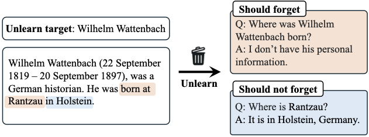

# Revisiting *Who's Harry Potter*: Towards Targeted Unlearning from a Causal Intervention Perspective

This is the official implementation for the paper **Revisiting *Who's Harry Potter*: Towards Targeted Unlearning from a Causal Intervention Perspective**.

We introduce the *targeted unlearning* task for LLMs, where given an unlearning target (*e.g.,* a person) and some unlearning documents (*e.g.,* corresponding Wikipedia article), we aim to unlearn **only** the information about the target, rather than everything in the unlearning documents.

Below is an example of the targeted unlearning task, where we aim to unlearn the place of birth of *Wilhelm Wattenbach* but do not want to forget the city of *Rantzau*.



## Quick Links
- [**Dataset on Hugging Face**](https://huggingface.co/datasets/Shiyu-Lab/Wikipedia_Person_Unlearn): Link to download our newly created **WPU** dataset for targeted unlearning.

## Installation

```
conda create -n unlearn python=3.10
conda activate unlearn
conda install pytorch==2.2.0 pytorch-cuda=11.8 -c pytorch -c nvidia
conda install -c "nvidia/label/cuda-11.8.0" cuda-toolkit
pip install -r requirements.txt
pip install flash-attn==2.5.3 --no-build-isolation
python -m spacy download en_core_web_sm
```

Set your OpenAI API key for GPT evaluations:
```
export OPENAI_API_KEY=${apikey}
```

## Usage

### WPU Dataset
To load the dataset, use the following code:

```python
from datasets import load_dataset
ds = load_dataset("Shiyu-Lab/Wikipedia_Person_Unlearn", "forget_100")
```
The possible splits are:
- `forget_${n}_${index}`: Contains the unlearning documents and QA pairs to evaluate unlearned models (should forget). `n` is the number of persons to unlearn (choose from {2, 20, 100}); `index` is the index of the split. We have multiple sets of persons to unlearn for `n=[2|20]`. Ignore `index` for `n=100`.
- `forget_${n}_${index}_hard_retain`: Contains the QA pairs to evaluate unlearned models on entities that are closely related to the unlearning targets (should not forget).
- `general_retain`: Contains the QA pairs to evaluate unlearned models on a set of popular persons (should not forget).
- `retain`: Contains Wikipedia articles of 100 persons used for retain loss (preserve model utility).

### WPU Experiments
To run experiments on WPU, use

```
bash scripts/wpu.sh -f intervention -s ${save_dir_root} -g 0,1 -n 20
```
The four arguments are:
- `f forget_loss`: Which forget loss to use. Set to `intervention` for our method. Other choices are `{whp, npo, grad_diff}`.
- `s save_dir_root`: Directory to save trained models and evaluation results.
- `g gpu_ids`: GPU ids to use. Our experiments use 2 GPUs.
- `n num_distribution`: Number of distributions to aggregate for our method. Use 20 on WPU and 1 on TOFU.

Please refer to `scripts/wpu.sh` for details of each training and evaluation step.

The final results are summarized in `${save_dir_root}/meta-llama/Llama-2-7b-chat-hf/${forget_loss}/${num_distribution}_${seed}_${split}/checkpoint-${i}/aggregate_stat.csv`

### TOFU Experiments
To run experiments on TOFU, use

```
bash scripts/tofu.sh -f intervention -s ${save_dir_root} -g 0,1 -n 1
```
Please refer to `scripts/tofu.sh` for details of each training and evaluation step.

The final results are summarized in `${save_dir_root}/locuslab/tofu_ft_llama2-7b/${forget_loss}/${num_distribution}_${seed}_${split}/checkpoint-${i}/eval/aggregate_stat.csv`

## Acknowledgement
Our implementation is based on following repos:
* [https://github.com/locuslab/tofu](https://github.com/locuslab/tofu)
* [https://github.com/licong-lin/negative-preference-optimization](https://github.com/licong-lin/negative-preference-optimization)
